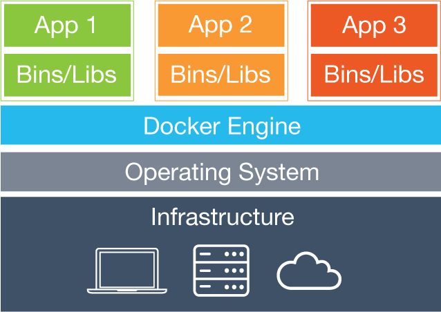

background-image: url(images/1_wide.png)
count: false

???
Notes:
- These are presenter notes
- For reference, see: https://github.com/gnab/remark/wiki

---
name: default
layout: true
background-image: url(images/bg.png)
class: middle

---
name: title
class: center

# Docker powered team and deployment


### David (daven) Numan

## http://davenuman.github.io/

---
name: title
class: center

# David (daven) Numan


https://civicactions.com/

???
Self intro. CA 4yrs, Drupal Dev, SysAdm.
Interest in Drupal+DevOps started in DrupalCon Amsterdam

---
name: sandboxes
class: inverse
background-image: url(images/sandbox.jpg)

## Sandbox

<br/><br/><br/><br/><br/><br/><br/><br/><br/><br/><br/><br/><br/><br/><br/>

???
This session is mostly about developer sandboxes. (And some automated testing / deployment, as time allows.)
- Parts of a sandbox:
- Code
- Database
- Services (LAMP stack)
- Developer Tools (Compass Sass)

---
class: inverse
background-image: url(images/sandbox-outside.jpg)

## Usage
## It can get messy.

???
 -
Never know how sandboxes might be used ...or what mess they might become.

Raise hand if you support your dev team's sandboxes.
Many ways to do it.
LAMP
MAMP
Vagrant
Aquia dev
AWS


---


## Introducing Docker


### Elegant new _cross-platform\*_ development and deployment tool.

\* I'll get back to this in a bit.

???
 +
 Docker uses the shipping container as a metaphor to describe itself.

 Build. Ship. Run.

 Common experience for dev, and deployment.

---
class: center
## Docker Containers




???
 +

Left side: typical virtual machine

Right side: docker containers. Uses the running kernel.

---
background-image: url(images/Container-ship.jpg)

???
 +
 Docker is quite efficient at running many containers in one host machine.
 - compared to virtual machine, can host hundreds of containers.

---
## The Docker Components

- Docker Engine - Hosts the containers
- **`docker`**  - "A self-sufficient runtime for containers."
- **`boot2docker`** - vagrant machine to run the docker host (engine)
- **`docker-compose`** - "Fast, isolated development environments using Docker."
- **`docker-machine`** - "Create and manage machines running Docker."
- kitematic - OSX gui
- Docker Registry (Docker Hub)

More details: https://www.docker.com/products/overview

???
 +
- Engine
- docker - command to build, run, stop, list, ... containers
- b2d - vagrant VM which runs docker engine
- compose - yaml config files
- machine - replaces the boot2docker cli. can connect to vagrant, or cloud
- kitematic - gui (windows too?) havne't tried yet.
- Registry - sharing docker images. Hub - much like github


---
class: center

### Put anything in a container

???
 +
 A container is a running instance of a docker image.

 Can be complex and large, similar to a virtual machine.
 Much better to be a simple service, even as small as a single process.

---
class: center

### Container city

???
 +
 Create many and connect them together.

---
class: full
background-image: url()
### Example docker-compose.yml file

.smallcode[
```yaml
db:
  image: mariadb:10.0
  environment:
    - MYSQL_ROOT_PASSWORD=root
    - MYSQL_USER=dbuser
  expose:
    - "3306"
php:
  image: php:5.6-fpm
  command: php-fpm --allow-to-run-as-root
  volumes:
    - .:/var/www/docroot
  links:
    - db
web:
  image: nginx:1.9
  links:
    - php
  volumes_from:
    - php
```
]

???
Compose is helpful for understanding docker.

---
background-image: url(images/docker-friends.png)

???
 +
 I took this image from the docker website. I really don't know what's going on in this picture. I recognize the penguin is likely the Linux tux.

 By the way, how many here run Linux on their workstation? Cheers.
 When I started working with Docker was excited. So many possibilities. Eager to get the dev team using this new flexible tool. Put together a few things and was ready to support docker based dev sandboxes.

 I saw the docker site had a full list of OS listed in their installation documentation. Just install docker and a few commands. So easy.

 -
 So we're good to go right? Then I got my Mac co-workers to use our new development sandbox...
 lol

---
background-image: url(images/run-aground.jpg)


???
 -!
This is my perception of Mac user's experience of Docker.
The official boot2docker is very slow for Drupal.
vboxfs

Also, docker is imho the best "Write once, run anywhere" technology available.
But we really mean in Linux only.

---
class: center
## Vagrant Boot2Docker
### (Thanks Leonid!)

### https://github.com/blinkreaction/boot2docker-vagrant

???
 +
Hope for OSX and Windows users.
We use this for all our non-Linux users.

"Those who don't run Linux are doomed to virtualize it."

...

So, we have docker for all our developers, now what. How do we get Drupal on there?

---
class: center
## Introducing Bowline


https://github.com/davenuman/bowline

???
 +
Project I started with simple bash scripts which attempt to ease Drupal project development on Docker.

Inspired by the DrupalCI testbot code, but diverged with a project sandbox focus.

8 contributors.  -- and we hired one of them :)

---
### Bowline Project Goals

#### Flexibility
- able to support latest Drupal stack and development tools, while also allowing for old outdated sites

#### Quick start
- default sandboxing should work in most cases and should be initialized with a minimal and simple configuration

#### Minimal requirements
- Docker is cross platform so this project should also work ootb on all platforms.

???
Flexible: also should work with a variety of hosting platforms.

Quick start: The ideal is that the developer clones the git repo and runs 'build'

Minimal requirements: Docker allows us to bake everything in. non-linux requirements handled by vagrant.

---
background-image: url()
class: full

## Install Bowline into your project repo

**wget 'https://raw.githubusercontent.com/davenuman/bowline/master/lib/bowline/install.sh' -O bowline-install.sh ; cat bowline-install.sh ; read -n1 -p "Run above script? (y/n)" ; if [ "$REPLY" = "y" ]; then bash bowline-install.sh; fi**

.smallcode[
```bash
[...]
 create mode 100644 lib/rigging/drupal-core-dev/drupal-core-dev.hoist
 create mode 100755 lib/rigging/phpunit/bin/phpunit
 create mode 100644 lib/rigging/phpunit/phpunit.hoist
 create mode 100644 sandbox.md
Bowline is now installed into your project repository.

Would you like to build the docker containers now? [Y/n]

# STARTING CONTAINERS
Creating existing_db_1...
Creating existing_php_1...
Creating existing_web_1...

Containers:
db   ~  172.17.0.6
php  ~  172.17.0.7
web  ~  172.17.0.8  http://172.17.0.8/

Would you like to initialize the Drupal settings file? [Y/n]
```
]

???
"Baking it in"

This script adds the bowline repository as a remote.
It then checks out the bowline code into your project and commits it. (Push it if you like it.)
At this point bowline is installed.

The script then (optionally) builds and starts the containers.
Once running, outputs IP addresses.
Prompts for initializing the Drupal settings.php file
Optionally runs drush site install for a new project.

---
## So, What does Bowline provide?

- Infrastructure as code. (via docker-compose)
- Tools and automation baked into repo.

???

- Infrastructure as code
- Tools and automation baked into repo.

---
## Typical Bowline Dev Sandbox Setup

```bash
git clone {repo url}

. bin/activate
build
settings_init
pull  # Custom per project
import
drush uli
```

---
## Bowline: command highlights

- check
- build
- import
- backup
- run

Overridden commands:
- drush
- composer
- phpcs

???

Bowline is basically a collection of small single purpose commands which do things in docker containers.

---


```bash
hoist drupal-core-dev
```

The **`hoist`** command clones the drupal repo into docroot. Ready to contribute.

???
The bowline default has php 5.5 which supports Drupal 8.

---
## Behat
```bash
hoist behat
```

## Codeception
```bash
hoist codeception
```

---
## Jenkins

### Example build step: Full test suite

```bash
cd $WORKSPACE/foobar
. bin/activate
build
sleep 2
run fullsuite
```

???

Who is familiar with Jenkins? (basically a super advanced task runner.)

This snippet is from one of our project's Jenkins builds.

We actually run the import in a separate Jenkins build on this project to reduce the time it takes to run the tests. Trade-off of time and accuracy.

---
## Some key sandbox challenges

- File permissions
- Docker api versions
- File sync

???

 - File perms solved in bowline's docker entry point.
 - different api's can be painful
 - file sync...

---
## Drupal Sandboxes on Docker: Some Alternatives

- Bowline plus vagrant boot2docker
- Drude plus vagrant boot2docker
- Official Drupal docker image
- Kalabox (now docker based)
- Kitematic
 - https://github.com/timbrandin/docker-drupal-kitematic
- Docker-Machine, docker-machine-nfs (?)

---
## "What do you love about Bowline?"

- Easy to use once installed
- Provides framework for pull, import, drush, behat, other commands that makes working with dockerized code easier
- I love that bowline comes with a Daven attached to the other end of the line.

???
Asked by co-workers what they like about bowline.
The third response most significant. --support for your system of choice.


---
## Deploy to production!

???

Ideally exactly the same process as the dev and test server.

Reality is many production hosting varieties. (AWS, Acquia, Pantheon, etc)

Bowline tried to stay out of the way of production hosting.

---
background-image: url(images/jam-session.jpg)

???

Seamless prod deployment, switching live.

---
# Ideas

Avoid the resource strain of a Vagrant VM:
 - Cloud dev
 - Local headless device on your network instead of vagrant.

Syncthing instead of NFS?

Docker hosting in production... ?
 - Immutable infrastructure
 - Security and compliance

???
 We are currently working on a server hosted bowline-docker dev environment. Will require a decent network connection -- cafe might not work well.
 Main challenge is the file syncing.

Production hosting. BoF?


---
class: center

## Final Thoughts

### **Git** has revolutionized code management and allowed for new work-flows

### **Docker** is revolutionizing the way we do infrastructure and deployment

???
 +
GitHub fork and Pull Request a prime example.

Docker perhaps easing continuous delivery? Perhaps in ways we haven't discovered yet.


---
background-image: url(images/docker-friends.png)

???

+
 Docker is fun

---
class: center

# Questions?

???

Thanks-you's

---
name: final
background-image: url(images/last_wide.png)

